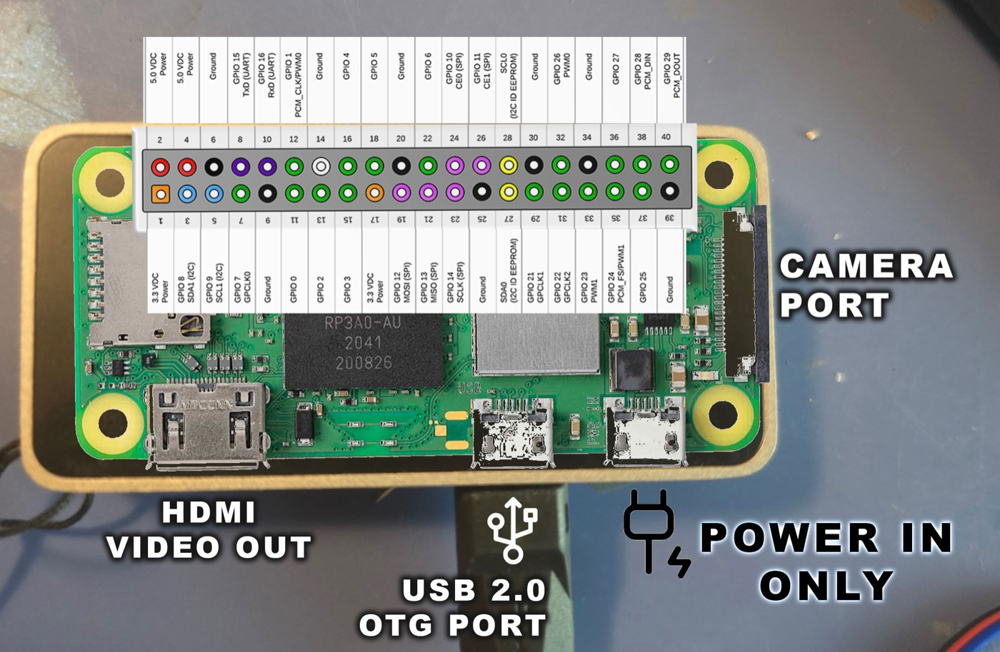

# Wiring

```diagram
wiring
```

Power the module from **5 V** and bring its **OUT** pin to a Pi GPIO. The OUT line idles at 3.3 V
TTL, which is safe for the Pi's 3.3 V inputs.

| Module pin | Seed header pin | Wire |
|---|---|---|
| VCC | **pin 2** (5V) | red |
| GND | **pin 6** (GND) | black |
| OUT | **pin 11** (GPIO17 / BCM 17) | green |
| TX  | pin 10 (GPIO15 RXD) | blue — *optional UART only* |
| RX  | pin 8 (GPIO14 TXD)  | yellow — *optional UART only* |



Notes:

- **VCC is 5 V**, not 3.3 V. The LD1040C is a 5 V module; only its OUT line is 3.3 V TTL.
- The default GPIO is **BCM 17** (header **pin 11**). Change it with `--gpio N` if you wire OUT to a
  different pin. The cog reads line N on `/dev/gpiochip0`.
- The UART wires are only needed for the optional telemetry (**telemetry** page). If you do not use
  UART, leave TX/RX unconnected.
- Mount the module on the **ceiling** facing the area you want to watch; the 110° beam covers a wide
  cone but only ~3–4 m deep.
