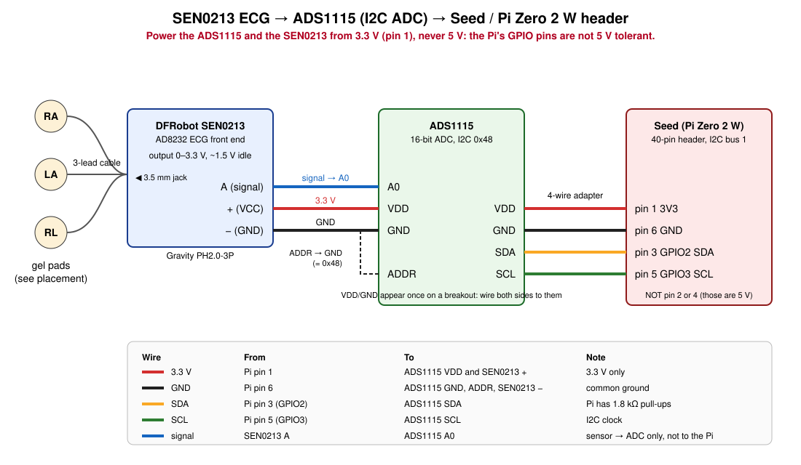
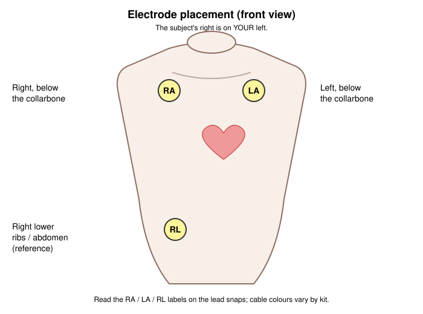
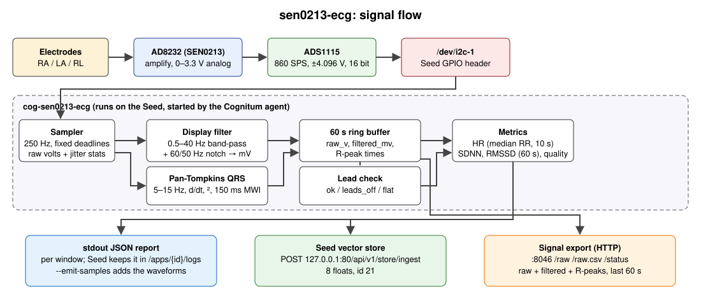

# sen0213-ecg

A Cognitum cog for the **DFRobot SEN0213** Gravity heart-rate sensor, which is an AD8232 single-lead ECG front end. The sensor's output is analog, and the Seed's Pi Zero 2 W has no analog input, so the signal goes through an **ADS1115** 16-bit I2C ADC on the Seed's GPIO header.

The cog exports the raw waveform and a filtered waveform, detects R-peaks with Pan-Tompkins, and reports heart rate, RR intervals, SDNN, RMSSD and a signal-quality score. When the leads are off, the signal is saturated or flat, or the ADC is missing, it says so instead of guessing.

**This is not a medical device.** Don't use it for diagnosis or treatment.



## Parts

- DFRobot SEN0213 with its 3-lead electrode cable and gel pads.
- An ADS1115 breakout. A generic one or the DFRobot Gravity ADS1115 (DFR0553) both work.
- A 4-wire I2C lead (3V3, GND, SDA, SCL) to the Seed's 40-pin header.
- The Seed (Pi Zero 2 W) with I2C enabled. See [Enable I2C](#enable-i2c-once-per-seed).

## Wiring

Power everything from **3.3 V on pin 1**. Don't use 5 V (pins 2 and 4). An ADS1115 breakout pulls SDA and SCL up to its own VDD, and the Pi's GPIO pins are not 5 V tolerant.

| From | To | Wire |
|---|---|---|
| Seed pin 1 (3V3) | ADS1115 **VDD** | 4-wire adapter, red |
| Seed pin 6 (GND) | ADS1115 **GND** | 4-wire adapter, black |
| Seed pin 3 (GPIO2, SDA) | ADS1115 **SDA** | 4-wire adapter |
| Seed pin 5 (GPIO3, SCL) | ADS1115 **SCL** | 4-wire adapter |
| ADS1115 **ADDR** | ADS1115 GND | jumper: sets address 0x48 |
| SEN0213 **A** (signal) | ADS1115 **A0** | Gravity cable |
| SEN0213 **+** | ADS1115 VDD (3.3 V) | Gravity cable |
| SEN0213 **−** | ADS1115 GND | Gravity cable |

Follow the **labels printed on the boards**, not cable colours; Gravity cable colours vary.

**Using the DFRobot Gravity ADS1115 (DFR0553):**
- The 4-wire Gravity I2C lead goes to the header: `+` to pin 1, `−` to pin 6, `D` to pin 3, `C` to pin 5.
- The SEN0213's Gravity cable plugs straight into analog port **A0**. That port also powers the sensor at 3.3 V.
- Leave the board's address switch on **0x48**.

With the Seed's header at the top and the SD card on the left, pin 1 is the top-left pin of the inner row. Pins 1, 3 and 5 run along that row; pin 6 is in the outer row, opposite pin 5.

### Electrodes



- **RA:** below the right collarbone.
- **LA:** below the left collarbone.
- **RL:** the reference, on the right lower ribs.

Read the RA/LA/RL labels on the lead snaps. Use fresh pads on clean, dry skin, and keep still while recording. DFRobot's guidance is to keep the pads close to the heart and on the correct sides of it.

**Electrical safety:** the AD8232 is not isolated. While the pads are on a person, power the Seed from a battery or a USB power bank, not a mains-connected laptop or charger. Don't use it on anyone with an implanted electronic device.

## Enable I2C (once per Seed)

The stock Seed image ships with I2C off. This was done on our Seed on 2026-10-01; the original config is backed up as `config.txt.pre-i2c`.

```bash
ssh genesis@<seed> 'sudo cp /boot/firmware/config.txt /boot/firmware/config.txt.pre-i2c
  echo "dtparam=i2c_arm=on" | sudo tee -a /boot/firmware/config.txt
  echo i2c-dev | sudo tee /etc/modules-load.d/i2c-dev.conf
  sudo systemctl reboot'
ssh genesis@<seed> 'ls /dev/i2c-1'    # must exist after the reboot
```

A firmware OTA may rewrite `config.txt`. After any OTA, check that `/dev/i2c-1` still exists.

## Install on a Seed

This cog isn't in Cognitum's store. `scripts/seed-sideload.sh` installs it the way the agent stores its own apps: binary plus `manifest.json` under `/var/lib/cognitum/apps/<id>/`. The agent lists it straight away; no restart is needed.

```bash
scripts/cross-build.sh sen0213-ecg                       # armhf + aarch64 into .cargo-target/dist/
scripts/seed-sideload.sh sen0213-ecg genesis@<seed>      # SSH key auth to the Seed
```

## Run

| How | Command |
|---|---|
| Seed console (one 10 s capture) | `POST /api/v1/apps/sen0213-ecg/console {"command":"--once"}` |
| Same, with the waveforms in the output | `{"command":"--once --emit-samples"}` |
| Without hardware | `{"command":"--once --simulate"}` (synthetic 72 bpm) |
| Continuous | `POST /api/v1/apps/sen0213-ecg/start`, then one report every `--interval` (5 s) |
| By hand on the Seed | `sudo /var/lib/cognitum/apps/sen0213-ecg/cog-sen0213-ecg-arm --once` |

## Outputs

**1. One JSON report per window, on stdout.** The Seed keeps these in `GET /api/v1/apps/sen0213-ecg/logs`.

| Field | Meaning |
|---|---|
| `status` | `ok`, `no_beats` (leads fine, under 2 RR intervals so far), `leads_off` (more than 5% of samples near 0 V or 3.3 V), `flat` (std below 2 mV: sensor unpowered or loose), `no_source` (ADC not found; includes `error`), `no_samples` (no samples read yet in this window) |
| `heart_rate_bpm` | 60000 / median RR over the last 10 s. `null` unless status is `ok`. |
| `r_peaks_ms`, `rr_ms`, `beats` | R-peak times (Unix ms) and RR intervals in this window |
| `sdnn_ms`, `rmssd_ms` | HRV over the last 60 s; they need 3+ intervals |
| `quality` | 0-1: `1 - 2 x SDNN / mean RR` over the last 10 s, and 0 unless the leads are OK with 2+ RR intervals. It measures beat-interval regularity, not signal cleanliness, so a low score means "don't trust the numbers" (or an irregular rhythm). |
| `raw` | min, max, mean and std of the raw volts |
| `samples`, `late_samples`, `max_late_ms`, `read_errors` | sampling health: count, missed deadlines, worst lateness, I2C errors |
| `samples_raw_v`, `samples_filtered_mv` | the waveforms, only with `--emit-samples`; at most 3000 each |
| `export` | URL of the HTTP export |
| `medical` | always `false` |

**2. An 8-float vector in the Seed store** (`POST 127.0.0.1:80/api/v1/store/ingest`, id 21). Each element is clamped to 0-1:

`[hr/200, quality, leads_ok, sdnn/200, rmssd/200, beats/20, median_rr/2000, max_raw_v/3.3]`

**3. The raw and processed signal export** over HTTP: read-only, the last 60 s, on `0.0.0.0:8046` by default with `Access-Control-Allow-Origin: *`. It starts **before** the ADC is found, so a hook-up tool sees `no_source` turn into a signal while you wire. Set `api_bind` to `127.0.0.1:8046` to keep it on the Seed. The data is ECG, so only expose it on a network you trust.

| Endpoint | Returns |
|---|---|
| `/raw?seconds=N` | JSON: `samples: [[t_ms, raw_v, filtered_mv], ...]` and `r_peaks_ms` |
| `/raw.csv?seconds=N` | CSV: `t_ms,raw_v,filtered_mv,r_peak` |
| `/status` | the latest report |

The signal path is shown below.



## Sensor guide

`guide/` holds this cog's sensor guide (WeftOS ADR-104): `guide.toml` for the page list, checklist links and diagram data (header pins, parts and wires, electrode placements, signal flow), plus ten Markdown pages:
- start, parts, wiring, electrodes, setup;
- calibrate, troubleshoot, API reference, safety, glossary.

The cog compiles the guide in and serves it at `GET :8046/guide`, so the app always shows the guide for the installed version. Validate it with `guide-check src/cogs/sen0213-ecg/guide` (`crates/sensor-guide` in this repository). `scripts/repo-gate.sh` builds `guide-check` and runs it as gate step 11.

## Hook-up and calibration app

`weft-ecg-scope`, an egui app (native and browser), is `crates/cog-ecg-scope` in this repository. Point it at the Seed (`SEED_HOST=169.254.42.1`, or `?seed=` in the browser) and it provides:
- a live hook-up checklist in wiring order;
- the ECG graph with R-peaks;
- calibration: baseline, rails, 50/60 Hz hum, R amplitude and polarity, SNR;
- cog settings through the agent config API, including "apply recommended notch";
- a tap-along pulse check;
- a RuView ADR-293 reference CSV export.

The agent's `PUT /api/v1/apps/<id>/config` **replaces** the whole config (measured on 0.24.2), so always send every key; the app merges for you.

## Processing

- **Sampling:** 250 Hz (100-500 configurable) against absolute deadlines, so there is no drift. The ADS1115 runs continuously at 860 SPS, ±4.096 V, 125 µV per LSB, so every read is a fresh conversion. Sample times are nominal (`t0 + n/fs`); the jitter is reported, not hidden.
- **Display waveform:** a 0.5 Hz high-pass and a 40 Hz low-pass (2nd-order Butterworth), plus a 60 Hz notch (`--mains-hz 50` in Europe, `0` to disable). Output is in mV.
- **R-peaks:** Pan-Tompkins (1985). A 5-15 Hz band-pass, a five-point derivative, squaring, and a 150 ms moving-window integration. Adaptive SPKI/NPKI thresholds come from a 2 s learning period, with a 200 ms refractory period. The R-peak is the largest band-passed excursion in the preceding 300 ms. RR intervals outside 300-2000 ms (30-200 bpm) are dropped.
- **No beats for the first 2 s** (the learning period), so a `--once` run uses a 10 s window by default.

## Verify after wiring

1. `--once --simulate` reports `status: ok` and about 72 bpm. That checks the cog and the Seed, not the hardware.
2. `--once` with **no pads on** should report `leads_off` or `flat`. It must not report `no_source`, which would mean the ADC wasn't found: check 3V3, GND, SDA, SCL and ADDR.
3. `--once` with the pads on and the subject still should report `ok`, a plausible heart rate, `quality` above 0.8 and `late_samples` near 0. Compare against a pulse count.
4. Read `/raw.csv?seconds=10` and plot `filtered_mv`. The QRS complexes should be clear, with the `r_peak` markers on them.

## Tested

- Host unit tests (17): ADS1115 config word and conversion, filters, Pan-Tompkins heart rate within 2 bpm at 50-160 bpm and at 250 and 500 Hz, R-peak position, HRV against hand-computed values, lead states, export routes and limits, and ingest response framing.
- **On our Seed (cog0, Pi Zero 2 W, 2026-10-01):**
  - `--once --simulate` through the agent's console API: exit 0 in 10.1 s, 72.1 bpm, 10 beats, 0 late samples.
  - `--once` with nothing wired: `no_source` (I2C I/O error at 0x48), exit 0.
- **0.1.1 on cog0 (2026-10-01):**
  - started by the agent with no hardware: `/status` = `no_source` with the I2C error, reachable from the Mac at `http://169.254.42.1:8046`;
  - switched to simulate through the config API: 72.1 bpm, quality 0.995, max lateness 1.6 ms;
  - all four app endpoints fetched from a browser origin (CORS OK).
- **Not yet tested:** a real ADS1115 and SEN0213 on the header, and a real person.
